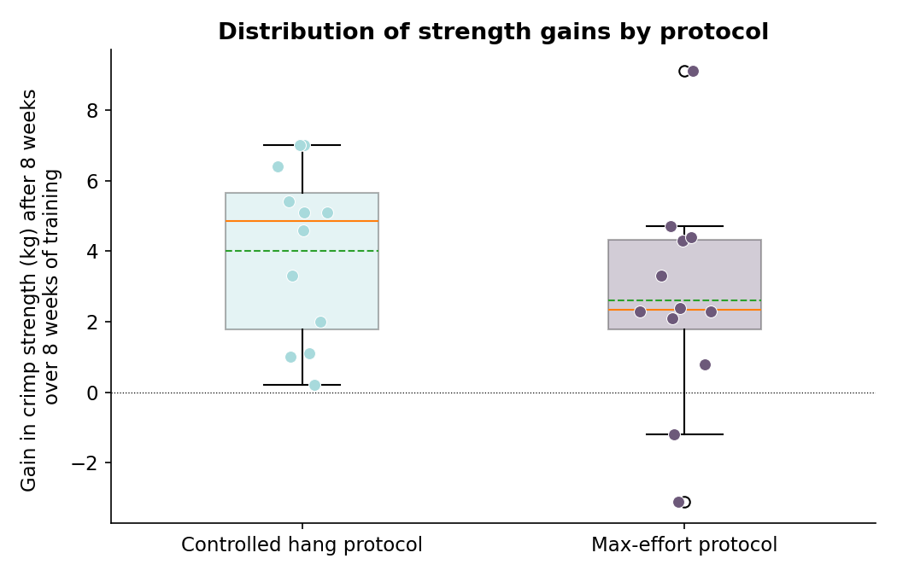

# Controlled Hangs vs. Max-Effort Hangs: An A/B Test for Finger Strength

This experiment tested whether a new fingerboard training protocol which consisted of controlled hangs was more efficient at building finger strength compared to the pre-existing traditional max-effort hangs.

The workflow consisted of a pre-registered design, power
analysis, randomisation checks, hypothesis testing with effect sizes and
a report of an inconclusive result.

## The question
Is the new controlled hang protocol better at building finger strength than the traditional method over 8 weeks.

## Design
- **Primary metric (pre-registered):** max added weight on a weighted crimp
  hold, baseline vs. week 8
- **Groups:** 24 climbers, randomly assigned 12/12
- **Confounder tracked:** climbing sessions per week outside the protocol

The power analysis was ran before any data collection, detecting a 2kg difference at 80% power required at least 36 climbers per group. However since only 12 were involved per group, the achieved power is only 37%. This means that the real effect would be missing around 2/3 of the time.

## Why simulated data
Collecting data over an 8 week period with 24 real climbing just wasn't feasable for this project. Finding climbers willing to follow the new protocol and be tested would take months. I did explore existing sport datasets, only to find randomly generated data with no correlations, therefore I decided on building the dataset myself.

## Results

| Metric | Value |
|---|---|
| Controlled hangs mean gain | +4.02 kg |
| Max-effort hangs mean gain | +2.62 kg |
| Difference | +1.40 kg |
| 95% CI | [-0.95, 3.75] kg |
| Cohen's d | 0.51 (medium) |
| p-value | 0.229 (not significant) |
| Power to detect a 2kg effect | ~37% |

## The finding
The analysis found that controlled hangs produced a 1.4kg greater average gain (95% CI [-0.95,3.75], Cohen's d = 0.51). With a p-value of 0.229, the difference was not significant at the 0.05 level.

## How to run
simulate_data.py → sanity_checks.py → hypothesis_test.py →
make_visuals.py